# DevOps Project - 2021

This project consists in 8 tasks that aim at using the devOps tools discovered during lab sessions over the fall semester.                            
For this project, we created one branch for each feature that we were asked to implement (except for Docker and Docker-compose which were done on the same branch). WHen the feature was working and the development wass finished, we would merge it into the main branch and base each new branch created on the main (as it was the "working" and "clean" one).


## Usage

*how to start and use the application, run the tests, ...*

* Clone this repository, from your local machine:
  ```
  git clone https://github.com/laure-a/audouy-poulain-devops.git devops-project
  cd devops-project
  ```
* Go to folder iac (cd iac)

  If you need to install vagrant guest additions for virtual box:
  ```
  vagrant plugin install vagrant-vbguest
  ```
  To create or start your VM, run the command:
  ```
  vagrant up
  ```
  You can access the web application at : 20.20.20.2:3000
  
*rajouter toutes les infos nécessaires pour installer les logiciels, les commandes pour lancer, etc*

## Authors

This project was carried out by:
* Laure AUDOUY: laure.audouy@edu.ece.fr
* Thomas POULAIN: thomas.poulain@edu.ece.fr        
                                                                                                                                                          
*Group 3 - SI Inter*

## Features

### 1. Enriched web application with automated tests	
For this part, we used the draft application located in the lab4 folder (continuois testing), and we enriched it by completing the sections that were marked "TO DO". This web application displays a message at localhost:3000, "Hello world!" and we implemented a few tests/completed the given code in the userapi folder of our project. You can see on the screenshot below that all tests work fine.  

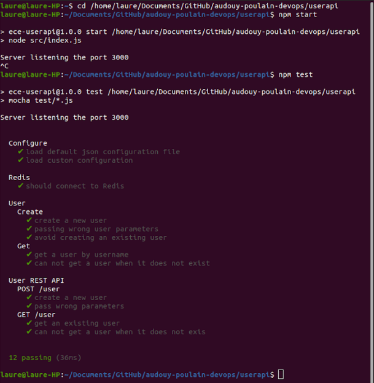

### 2. Continuous Integration and Continuous Delivery (and Deployment)
We used GitHub Actions for CI and Heroku for CD. However, Heroku deployment platform required credit card information to use their database service. Therefore, we were not able to use it, but our application still is deployed and displays the Hello world message on the web page. You can find the related code in the .github folder of our project.
* GitHub Actions
We followed the steps indicated in the CI/CD lab. We created a workflow:

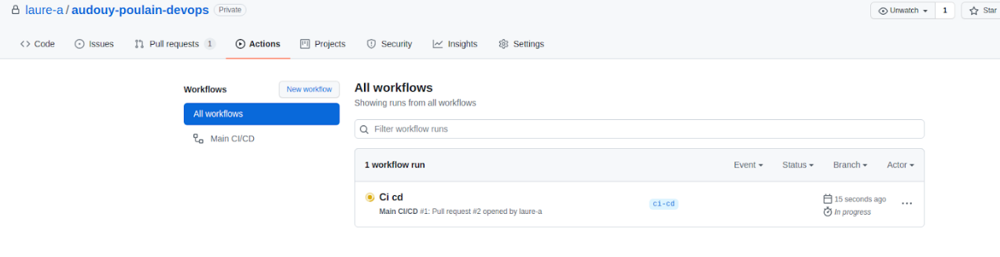

After creating our workflow (see hidden folder .githbub in our project), we made some tests by creating a pull request for merging the CI/CD branch into the main (as our CI checks are conducted when merging code into the main branch). You might see this, but we did not merge every pull request as we had some unsuccessful try outs at first (we also wanted to finish the CD part before merging the branch).

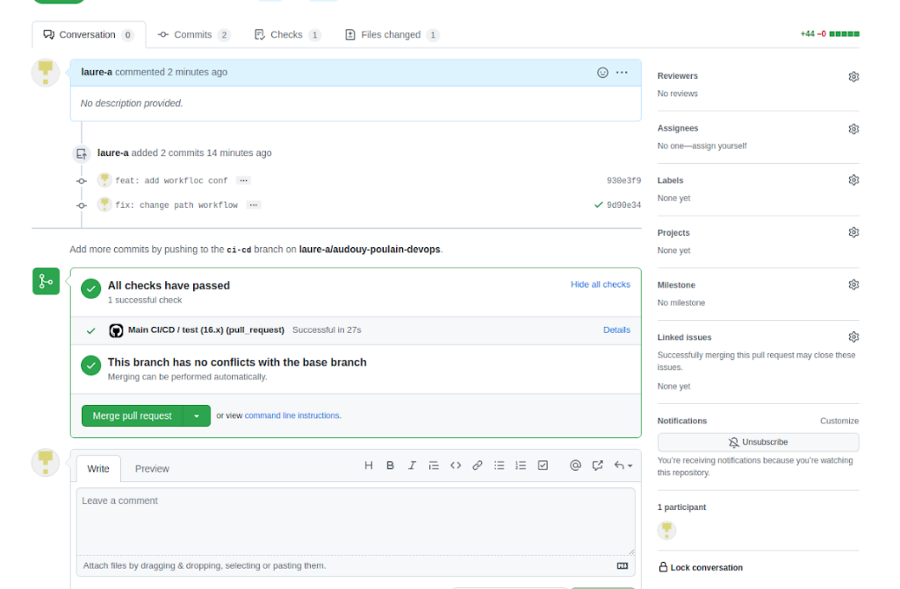

* Deployment with Heroku

To deploy our app, we added some commands in our workflow and created an Heroku account. We ran our code and deployed our app to Heroku by following the lab steps (+ tests with github pull requests). We can see on the picture below that our project is present on the Heroku platform:

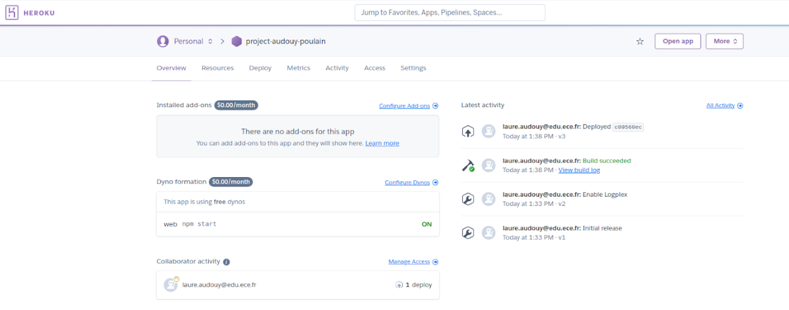

Also, our web app can be accessed via this link (which we get by clicking on the "open app" button on Heroku:
https://project-audouy-poulain.herokuapp.com/
And here is a screenshot of what is displayed: this is our app, we do get the same result as when running our app locally on localhost:3000 with "npm start".

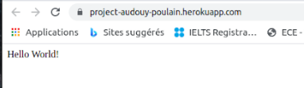

Finally, we created one last pull request for merging our ci-cd branch into the main branch and got the following successful results: 

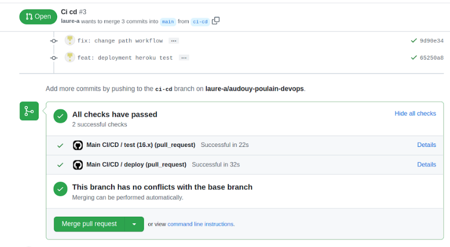

### 3. Infrastructure as code using Ansible
Folder iac: in our Vagrantfile, we configured a VM (on virtual box) running on Centos7 Linux distribution. However, due to our settings/installs on virtual box and vagrant, we needed to install a vagrant plugin to allow virtual box guest.

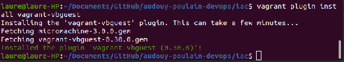

Once our VM configured, we provisioned it using Ansible. For this part, we had to install and run nodejs as the language runtime for our vm, the redis database, sync our application (userapi) and create health checks for our application. We started with node and redis. For nodejs, we used a script link. Here is preview of the redis insallation being successful:

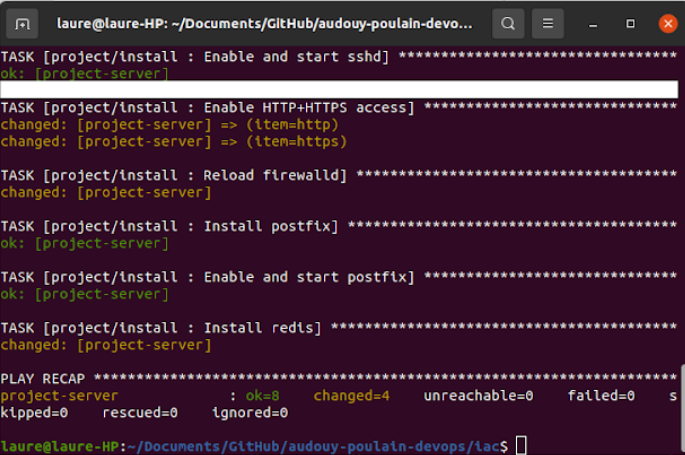

We then used the sync folders to provision the vm with our user api and created health checks for it. See screenshots below:

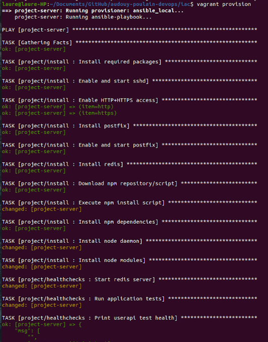
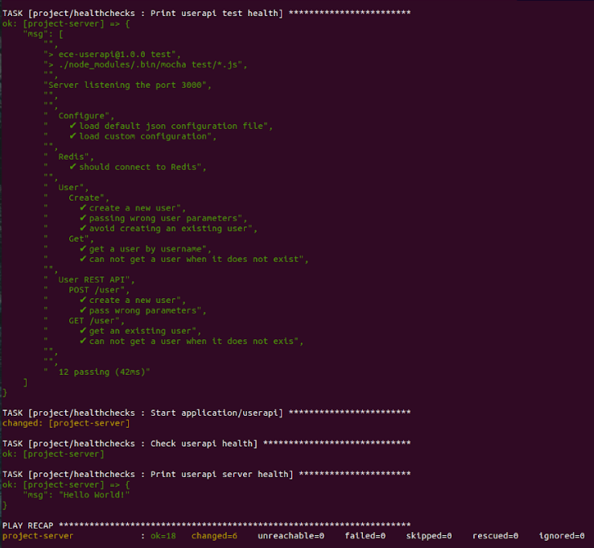

At the end, after running the commands listed in the "usage" part of this readme, you should be able to display this web page:

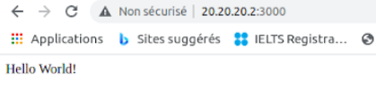

### 4. Containerisation with Docker
In this part, the goal was to create a docker image of our application. This was done by creating a Dockerfile with all the instructions. We built it, got our image, and accessed it via localhost after running it:

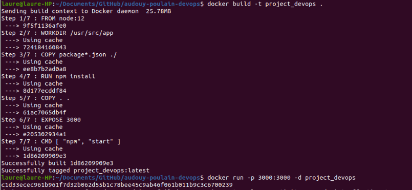
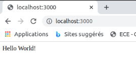

The second part consisted in pushing this image to Docker Hub. For this, we created an account on docker hub and logged in via the command line interface (terminal) on our local machine. This way, we were able to tag and push the previously created image to docker hub. 
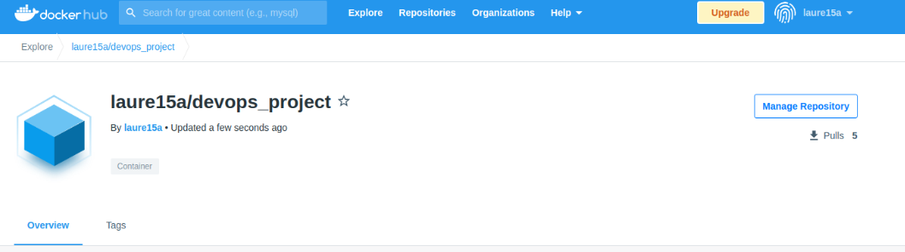
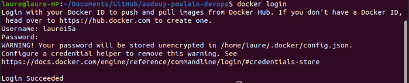

Here is the image we pushed on docker hub: "laure15a/devops_project"

### 5. Orchestration with Docker Compose
Here, we created a docker-compose.yaml file to start our application. This way, we were able to run our previously created docker image but also the redis database.

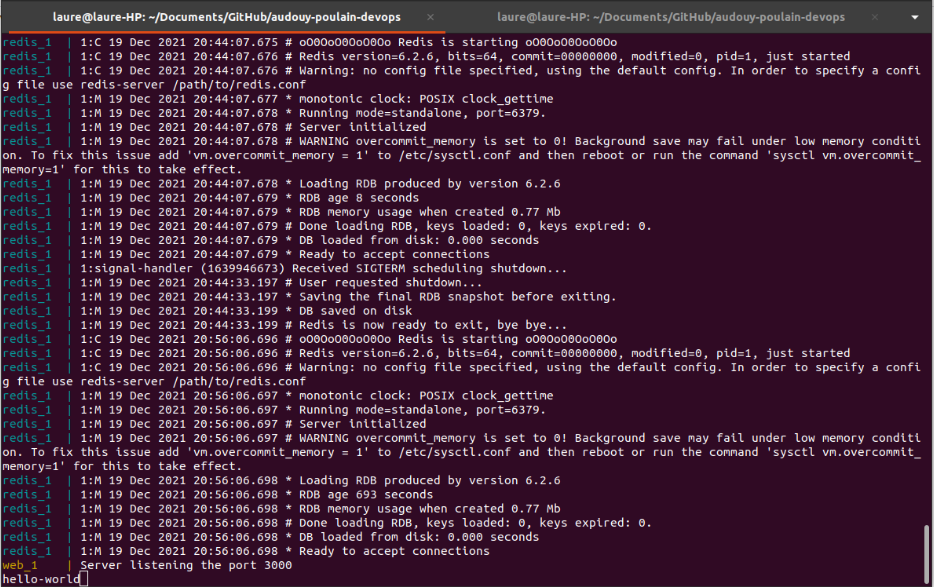
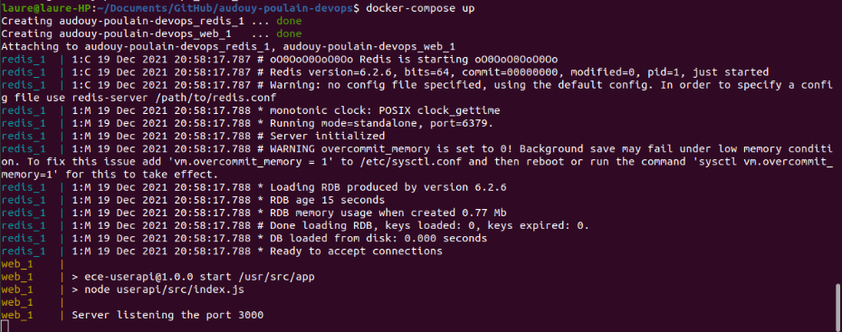

### 6. Orchestration with Kubernetes
### 7. Service mesh using Istio
### 8. Monitoring

