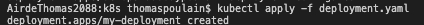
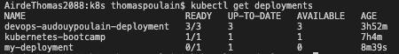
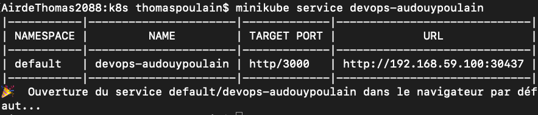
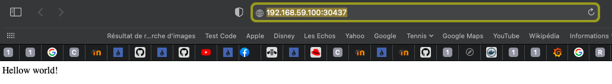
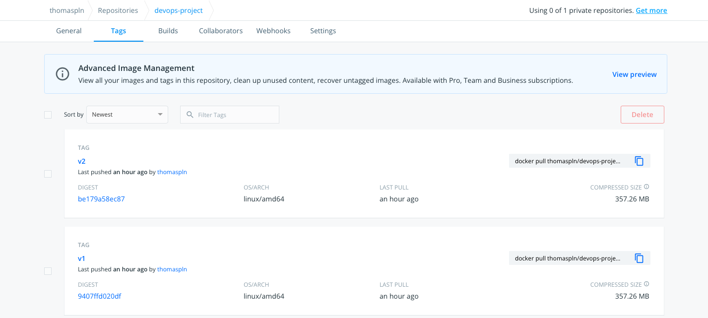
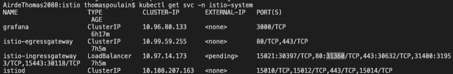
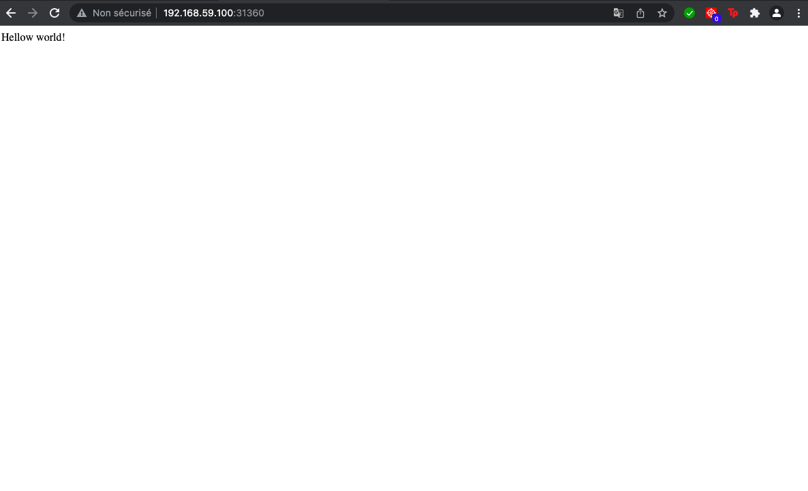
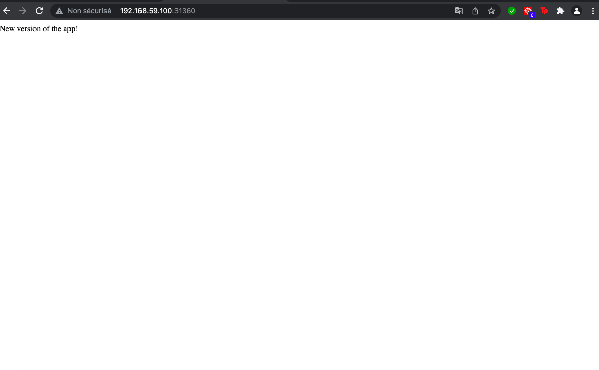

# DevOps Project - 2021

This project consists in 8 tasks that aim at using the devOps tools discovered during lab sessions over the fall semester.                            
For this project, we created one branch for each feature that we were asked to implement (except for Docker and Docker-compose which were done on the same branch). WHen the feature was working and the development wass finished, we would merge it into the main branch and base each new branch created on the main (as it was the "working" and "clean" one).


## Usage

*how to start and use the application, run the tests, ...*

* Clone this repository, from your local machine:
  ```
  git clone https://github.com/laure-a/audouy-poulain-devops.git devops-project
  cd devops-project
  ```
* Go to folder iac (cd iac)

  If you need to install vagrant guest additions for virtual box:
  ```
  vagrant plugin install vagrant-vbguest
  ```
  To create or start your VM, run the command:
  ```
  vagrant up
  ```
  You can access the web application at : 20.20.20.2:3000
  
* Docker
    ```
  # add "sudo" at the beginning if necessary
  #to build the image (do not forget the "." at the end)
  docker build -t project-devops .
  #to run it 
  docker run -p 3000:3000 -d project-devops
  ```
  The web app is accessible at localhost:3000
  
* Docker compose
  Go to the root directory of the project and run:
   ```
  # add "sudo" at the beginning if necessary
  docker-compose up
  ```
  

## Authors

This project was carried out by:
* Laure AUDOUY: laure.audouy@edu.ece.fr
* Thomas POULAIN: thomas.poulain@edu.ece.fr        
                                                                                                                                                          
*Group 3 - SI Inter*

## Features

### 1. Enriched web application with automated tests	
For this part, we used the draft application located in the lab4 folder (continuois testing), and we enriched it by completing the sections that were marked "TO DO". This web application displays a message at localhost:3000, "Hello world!" and we implemented a few tests/completed the given code in the userapi folder of our project. You can see on the screenshot below that all tests work fine.  


### 2. Continuous Integration and Continuous Delivery (and Deployment)
We used GitHub Actions for CI and Heroku for CD. However, Heroku deployment platform required credit card information to use their database service. Therefore, we were not able to use it, but our application still is deployed and displays the Hello world message on the web page. You can find the related code in the .github folder of our project.
* GitHub Actions
We followed the steps indicated in the CI/CD lab. We created a workflow:


After creating our workflow (see hidden folder .githbub in our project), we made some tests by creating a pull request for merging the CI/CD branch into the main (as our CI checks are conducted when merging code into the main branch). You might see this, but we did not merge every pull request as we had some unsuccessful try outs at first (we also wanted to finish the CD part before merging the branch).


* Deployment with Heroku

To deploy our app, we added some commands in our workflow and created an Heroku account. We ran our code and deployed our app to Heroku by following the lab steps (+ tests with github pull requests). We can see on the picture below that our project is present on the Heroku platform:


Also, our web app can be accessed via this link (which we get by clicking on the "open app" button on Heroku:
https://project-audouy-poulain.herokuapp.com/
And here is a screenshot of what is displayed: this is our app, we do get the same result as when running our app locally on localhost:3000 with "npm start".


Finally, we created one last pull request for merging our ci-cd branch into the main branch and got the following successful results: 


### 3. Infrastructure as code using Ansible
Folder iac: in our Vagrantfile, we configured a VM (on virtual box) running on Centos7 Linux distribution. However, due to our settings/installs on virtual box and vagrant, we needed to install a vagrant plugin to allow virtual box guest.


Once our VM configured, we provisioned it using Ansible. For this part, we had to install and run nodejs as the language runtime for our vm, the redis database, sync our application (userapi) and create health checks for our application. We started with node and redis. For nodejs, we used a script link. Here is preview of the redis insallation being successful:


We then used the sync folders to provision the vm with our user api and created health checks for it. See screenshots below:


At the end, after running the commands listed in the "usage" part of this readme, you should be able to display this web page:


### 4. Containerisation with Docker
In this part, the goal was to create a docker image of our application. This was done by creating a Dockerfile with all the instructions. We built it, got our image, and accessed it via localhost after running it:


The second part consisted in pushing this image to Docker Hub. For this, we created an account on docker hub and logged in via the command line interface (terminal) on our local machine. This way, we were able to tag and push the previously created image to docker hub. 


Here is the image we pushed on docker hub: "laure15a/devops_project"

### 5. Orchestration with Docker Compose
Here, we created a docker-compose.yaml file to start our application. This way, we were able to run our previously created docker image but also the redis database.


### 6. Orchestration with Kubernetes

Kubernetees, often called k8s, is an open source system for automating deployment and scaling that uses containers to make up an application into logical units for easy management and discovery. It is mainly written in Google Go. To represent the state of the cluster used, we use objects that are mainly  pods, deployments or services. Kubernetees can also be used for storage using volumes.

In this part, we used minikube as our cluster and we had to create four .yaml files to run the application : deployment, service, persistent volume and persistent volume claim.

We used the following commands in this part :

* To start our cluster minikube :
  ```
  minikube start
  ```
* To apply configurations made in a .yaml file  :
  ```
  kubectl apply -f name_of_the_file.yaml
  ```
* To get the information about the different pods, deployments or services :
  ```
  kubectl get deployment
  kubectl get service
  kubectl get pod
  ```
* To run a web browser to reach the application :
  ```
  minikube service devops-audouypoulain
  ```
* To get the ip of our minikube :
  ```
  minikube ip
  ```
Here is what you are supposed to see when running some of the commands:

* When applying a file, you should have a confirmation message like this :



* If you try to get your deployments you should have the list of your deployments like this :



* When you launch your app by using minikube service devops-audouypoulain



  Then, it should open a web browser and launch your app on the url indicated on the screen before; like this :


 
### 7. Service mesh using Istio

The aim of this part was to be able to launch our app using Istio and to create 2 route requests and 2 traffic shifting between the 2 versions of our app. 
Istio is a platform that implements service mesh, and that provides a uniform way to secure, connect, and monitor microservices.

We first had to configure our minikube to have as driver virtual box. Then we were able to download Istio and to install it and it was ready to be used. We then could run our app with Istio.

Then, we had to create a second version of our app. We changed for that the message displayed by the app. Then we built a docker image and pulled it to our docker hub. That way, we had two docker images that correspond to each version of our app. 

Then, we changed our deployment.yaml file to make it accept the two versions of our app : a v1 and a v2. At this moment, we deployed the three service mesh components which are: gateway, the destination rule and the virtual service. We created a yaml file for each of them.
At this moment, we could chose from the virtual service file which version of the app we wanted to launch. And then, we implemented it in a way that each version of the app could be laucnhed depending on a weight which determines the frequency at which a version is launched compared to the other ( if both weight are 50, they have the same chance to be launched.

After the commands used to install Istio, we used the following ones to make our code work:

* To start our cluster minikube with the right parameters :
  ```
  minikube start --memory=2000 --cpus=2 --kubernetes-version=v1.22.3
  ```
* To build the new docker image :
  ```
  docker build -t devops_project:v2 .
  ```
* To tag it to make it recognizable by our repository :
  ```
  docker tag devops-project:v2 thomaspln/devops-project:v2
  ```
* To push it to our repository :
  ```
  docker push thomaspln/devops-project:v2
  ```
* To apply our new (gateway, virtualservice, destinationrule) or changed (deployment) yaml files:
  ```
  kubectl apply -f deployment.yaml
  ```
* To get the ip of our minikube :
  ```
  minikube ip
  ```
* To get the  public IP for Istio access :
  ```
  kubectl get svc -n istio-system
  ```
* To run the app, we just have to put http://192.168.59.100:31360/ on our browser. 192.168.59.100 corresponds to our minikube ip and 31360 corresponds to the number associated with our istio system when we call kubectl get svc -n istio-system. We have to look to the number next to our port number definer in gateway.yaml.

Then, we had the folloing results : 

* Our repository now looks like that:


  
* When launching the kubectl get svc -n istio-system command,  we obtain this and we can then find the number that we will use to launch our app ( highlighted on the picture):



* When we launch our app in our browser, either version can be launched :

v1: 



or v2:



We put as weight 80 for v1 and 20 for v2 and the results was logical as v1 appeared 7 times out of 10.


  
  


### 8. Monitoring

